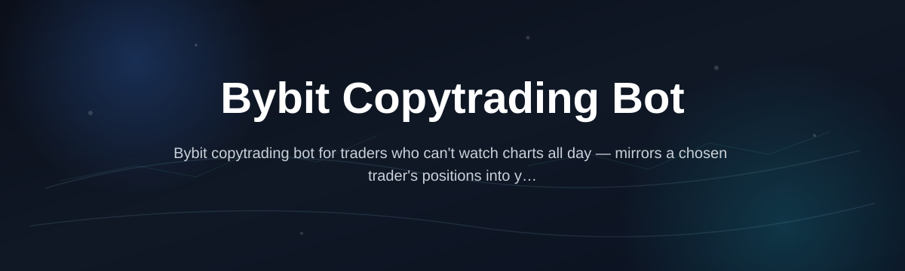
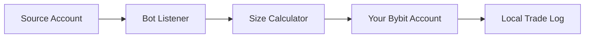

# bybit-copytrade-bot

*For traders who want to mirror a chosen Bybit account's positions automatically, without babysitting charts all day.*

## Quick start

1. Open the download page below and grab the latest Windows build.
2. Unzip it anywhere — no installer, no admin rights needed.
3. Run the `.exe`, paste your Bybit API key/secret, pick the source account to follow, and hit **Start**.

That's it — the rest of this README explains the details, edge cases, and what to do if something looks off.

## What this is

**bybit-copytrade-bot** is a standalone Windows application that watches a source Bybit account (yours or one you've been given read access to) and replicates its trades on your own account in near real time. It's built for people who already understand futures/spot risk on Bybit but don't have time to manually copy entries, exits, and size adjustments as they happen.

The bot doesn't guess or predict anything — it listens for order and position events from the source account through the Bybit API and mirrors them proportionally to your account balance. You stay in control of leverage limits, max position size, and which symbols get copied, so it behaves like an assistant executing your rules rather than a black box making decisions for you.

  

The button above opens the project's download page where you can grab the current build.

## Who it is for

- **Traders following a mentor or signal account** who want their own account to mirror trades without manual entry.
- **Small trading groups** where one member runs the strategy and others copy it on their own capital.
- **Busy part-time traders** who can't watch charts during work hours but still want to stay in a strategy.
- **Prop or personal multi-account setups** where one Bybit account needs to shadow another for testing or diversification.
- **Developers evaluating copy-trade logic** before building something more custom on top of the Bybit API.

## What you can do

- **Mirror trades from a source account** in near real time, including entries, exits, and partial closes.
- **Scale position size proportionally** to your own account balance instead of copying raw contract sizes blindly.
- **Set a maximum position size or leverage cap** so the source account can't push you further than you're comfortable with.
- **Whitelist or blacklist specific symbols**, so only the pairs you actually want to trade get copied.
- **Pause or resume copying instantly** without closing the app or losing your configuration.
- **Run multiple copy profiles** if you follow more than one source account or strategy.
- **Log every copied trade locally** so you can review what happened and when, after the fact.
- **Keep API keys stored locally only** — nothing is sent to a third-party server.

## Getting started

1. Visit the [download page](https://LimeEnvoyEnlarge99.github.io/bybit-copytrade-bot/) and download the current Windows build.
2. Extract the folder — there's nothing to compile or install.
3. Launch the `.exe` and enter your Bybit API key and secret (read/trade permissions, no withdrawal).
4. Enter the source account's identifier or public API key you're copying from, set your size ratio, and confirm.
5. Click **Start** — the status panel will show "Connected" once it's syncing with the source account.

## Requirements

- Windows 10 or 11 (64-bit).
- A Bybit account with API trading permissions enabled.
- No Python, Node, or any build toolchain — it's a standalone `.exe`.
- A stable internet connection; the bot needs to stay running to keep copying in real time.

## How it works

1. You connect your Bybit account via API key and select a source account to follow.
2. The bot subscribes to the source account's order/position stream.
3. When the source opens, adjusts, or closes a position, the bot calculates the equivalent size for your account.
4. It sends a matching order through your own Bybit API connection.
5. The result is logged locally so you can confirm what was copied and when.

## FAQ

**Is a Bybit copytrading bot allowed by Bybit's terms?**
Using your own API keys to automate your own account is generally fine under Bybit's API terms. Always check the current Bybit API terms of service before running any automated tool, especially if you're copying a third-party account.

**Do I need coding experience to use this?**
No. The app is a Windows executable with a simple form for your API keys and copy settings — no scripting required.

**Can it copy trades from any Bybit account, or only ones I own?**
It can copy from any account whose API key (with at least read access) you're authorized to use. You cannot copy a private account without permission — there's no way around that, and this tool doesn't attempt to.

**Will it work with both spot and futures accounts?**
Yes, as long as the source and destination accounts trade the same market type. Cross-market copying (e.g., spot source to futures destination) isn't supported.

**How fast does it copy trades?**
Typically within one to two seconds of the source account's action, depending on your connection and Bybit's API response time. It's not instant, so very fast scalping strategies may see some slippage.

## Troubleshooting

- **"Connection failed" on startup** — double check your API key has trading permissions enabled and that your system clock is accurate (Bybit rejects requests with too much time drift).
- **Trades aren't being copied** — confirm the source account identifier is correct and that the source account is actually placing orders through the API, not just the mobile app UI in a way the stream doesn't catch.
- **Position sizes look off** — check your size ratio setting; it scales relative to account balance, not raw contract count, so a mismatch in balances will change the copied size.
- **App won't launch / Windows blocks it** — right-click the `.exe`, choose Properties, and unblock it, or allow it through Windows Defender SmartScreen.

## License

Released under the [MIT License](LICENSE). This project is provided as-is with no warranty — you are responsible for your own trading decisions and any resulting gains or losses.

  

